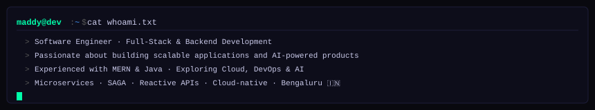
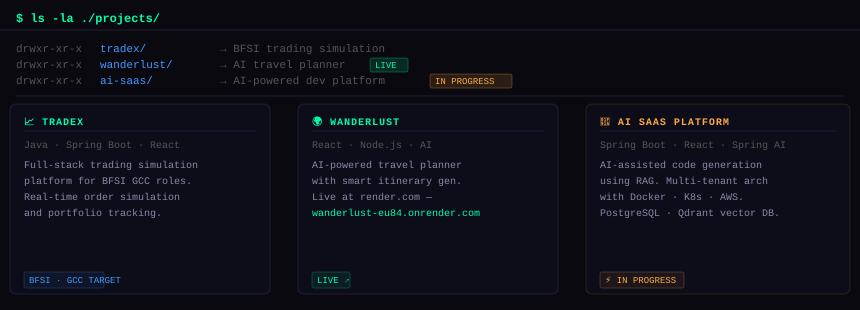
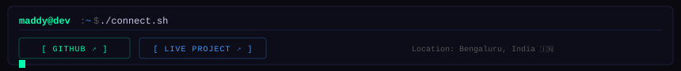

<div align="center">

<!-- HERO BANNER -->


<!-- STATUS BADGES -->
<p>
  
  
  
  
</p>

</div>

---

<!-- WHOAMI — rendered as SVG terminal -->


---

<!-- SYSTEM SCAN — rendered as SVG terminal panels -->


---

## `$ ls -la ./stack/`

<div align="center">

**Languages**


**Backend**


**Frontend**


**Databases**


**Cloud & DevOps**


**Observability & AI**


</div>

---

<!-- PROJECTS — rendered as SVG terminal panel -->


---

## `$ git log --stats`

<div align="center">


</div>

---

## `$ cat certs.txt`

```
[✓]  100xDevs DevOps Bootcamp              classx.co.in
     └── Linux · EC2 · ECS · K8s · Terraform · Helm · CI/CD · GitOps
```

---

<!-- CONNECT — rendered as SVG terminal panel -->


<div align="center">

[](https://github.com/maddy74)
[](https://wanderlust-eu84.onrender.com/listings)

</div>

---

<div align="center">


*"Build systems that don't just work — build systems that survive."*

</div>
